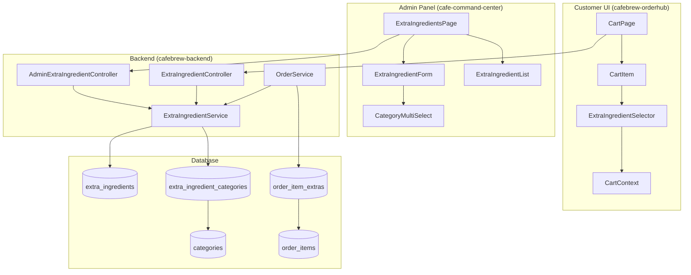

# Design Document: Extra Ingredients Feature

## Overview

The Extra Ingredients feature extends CafeBrew's ordering system to support customizable add-ons for menu items. This design introduces a new `ExtraIngredient` entity with a many-to-many relationship to `Category`, allowing administrators to define add-ons that appear for specific menu categories. The system captures selected extras at order time, storing them as `OrderItemExtra` records with price snapshots for accurate order history.

The implementation spans three codebases:
- **cafebrew-backend**: Java/Spring Boot backend with new entities, repositories, services, and REST endpoints
- **cafe-command-center**: React admin panel with extra ingredients management page
- **cafebrew-orderhub**: React customer UI with cart page extras selection

## Architecture



## Components and Interfaces

### Backend Components

#### 1. ExtraIngredient Entity
New JPA entity representing an extra ingredient add-on.

```java
@Entity
@Table(name = "extra_ingredients")
public class ExtraIngredient {
    @Id
    @GeneratedValue(strategy = GenerationType.IDENTITY)
    private Long id;
    
    @Column(nullable = false, unique = true, length = 100)
    private String name;
    
    @Column(length = 500)
    private String description;
    
    @Column(nullable = false, precision = 10, scale = 2)
    private BigDecimal price;
    
    @Column(nullable = false)
    private Boolean active = true;
    
    @ManyToMany
    @JoinTable(
        name = "extra_ingredient_categories",
        joinColumns = @JoinColumn(name = "extra_ingredient_id"),
        inverseJoinColumns = @JoinColumn(name = "category_id")
    )
    private Set<Category> categories = new HashSet<>();
    
    private LocalDateTime createdAt;
    private LocalDateTime updatedAt;
}
```

#### 2. OrderItemExtra Entity
New JPA entity storing extra ingredients selected for an order item.

```java
@Entity
@Table(name = "order_item_extras")
public class OrderItemExtra {
    @Id
    @GeneratedValue(strategy = GenerationType.IDENTITY)
    private Long id;
    
    @ManyToOne(fetch = FetchType.LAZY)
    @JoinColumn(name = "order_item_id", nullable = false)
    private OrderItem orderItem;
    
    @Column(name = "extra_ingredient_id", nullable = false)
    private Long extraIngredientId;
    
    @Column(name = "extra_ingredient_name", nullable = false)
    private String extraIngredientName;
    
    @Column(nullable = false, precision = 10, scale = 2)
    private BigDecimal price;
}
```

#### 3. ExtraIngredientService
Service layer handling business logic for extra ingredients.

```java
public interface ExtraIngredientService {
    // Admin operations
    List<ExtraIngredient> getAllExtraIngredients();
    ExtraIngredient getExtraIngredientById(Long id);
    ExtraIngredient createExtraIngredient(CreateExtraIngredientRequest request);
    ExtraIngredient updateExtraIngredient(Long id, UpdateExtraIngredientRequest request);
    void deleteExtraIngredient(Long id);
    
    // Customer operations
    List<ExtraIngredient> getActiveExtraIngredientsByCategory(Long categoryId);
    List<ExtraIngredient> getActiveExtraIngredientsByCategories(List<Long> categoryIds);
    
    // Order validation
    void validateExtraIngredients(List<Long> extraIngredientIds);
}
```

#### 4. REST Controllers

**AdminExtraIngredientController** (authenticated):
- `GET /api/admin/extra-ingredients` - List all extra ingredients
- `POST /api/admin/extra-ingredients` - Create extra ingredient
- `PUT /api/admin/extra-ingredients/{id}` - Update extra ingredient
- `DELETE /api/admin/extra-ingredients/{id}` - Delete extra ingredient

**ExtraIngredientController** (public):
- `GET /api/extra-ingredients/by-category/{categoryId}` - Get extras for a category
- `GET /api/extra-ingredients/by-categories?ids=1,2,3` - Get extras for multiple categories

### Frontend Components (Admin Panel)

#### 1. ExtraIngredientsPage
Main page component for managing extra ingredients.

```typescript
interface ExtraIngredientsPageProps {}

// Features:
// - List all extra ingredients with name, price, categories, status
// - Add/Edit/Delete actions
// - Toggle active status
// - Refresh functionality
```

#### 2. ExtraIngredientForm
Modal form for creating/editing extra ingredients.

```typescript
interface ExtraIngredientFormProps {
  open: boolean;
  onOpenChange: (open: boolean) => void;
  extraIngredient: ExtraIngredient | null;
  categories: Category[];
  onSubmit: (data: CreateExtraIngredientRequest | UpdateExtraIngredientRequest) => Promise<boolean>;
  saving: boolean;
}
```

#### 3. useExtraIngredients Hook
Custom hook for extra ingredients state management.

```typescript
interface UseExtraIngredientsReturn {
  extraIngredients: ExtraIngredient[];
  loading: boolean;
  error: string | null;
  saving: boolean;
  refetch: () => Promise<void>;
  createExtraIngredient: (data: CreateExtraIngredientRequest) => Promise<ExtraIngredient | null>;
  updateExtraIngredient: (id: number, data: UpdateExtraIngredientRequest) => Promise<ExtraIngredient | null>;
  deleteExtraIngredient: (id: number) => Promise<boolean>;
}
```

### Frontend Components (Customer UI)

#### 1. ExtraIngredientSelector
Component for selecting extras on cart items.

```typescript
interface ExtraIngredientSelectorProps {
  categoryId: number;
  selectedExtras: SelectedExtra[];
  onExtrasChange: (extras: SelectedExtra[]) => void;
}

interface SelectedExtra {
  id: number;
  name: string;
  price: number;
}
```

#### 2. Updated CartContext
Extended cart context to support extra ingredients.

```typescript
interface CartItem {
  menuItem: MenuItem;
  quantity: number;
  extras: SelectedExtra[];  // NEW
}

interface CartContextType {
  // ... existing methods
  updateItemExtras: (menuItemId: number, extras: SelectedExtra[]) => void;  // NEW
}
```

## Data Models

### Database Schema

```sql
-- Extra Ingredients table
CREATE TABLE extra_ingredients (
    id BIGINT PRIMARY KEY AUTO_INCREMENT,
    name VARCHAR(100) NOT NULL UNIQUE,
    description VARCHAR(500),
    price DECIMAL(10,2) NOT NULL,
    active BOOLEAN NOT NULL DEFAULT TRUE,
    created_at TIMESTAMP NOT NULL DEFAULT CURRENT_TIMESTAMP,
    updated_at TIMESTAMP
);

-- Junction table for many-to-many relationship
CREATE TABLE extra_ingredient_categories (
    extra_ingredient_id BIGINT NOT NULL,
    category_id BIGINT NOT NULL,
    PRIMARY KEY (extra_ingredient_id, category_id),
    FOREIGN KEY (extra_ingredient_id) REFERENCES extra_ingredients(id) ON DELETE CASCADE,
    FOREIGN KEY (category_id) REFERENCES categories(id) ON DELETE CASCADE
);

-- Order item extras (price snapshot at order time)
CREATE TABLE order_item_extras (
    id BIGINT PRIMARY KEY AUTO_INCREMENT,
    order_item_id BIGINT NOT NULL,
    extra_ingredient_id BIGINT NOT NULL,
    extra_ingredient_name VARCHAR(100) NOT NULL,
    price DECIMAL(10,2) NOT NULL,
    FOREIGN KEY (order_item_id) REFERENCES order_items(id) ON DELETE CASCADE
);
```

### DTO Definitions

```typescript
// Request DTOs
interface CreateExtraIngredientRequest {
  name: string;
  description?: string;
  price: number;
  categoryIds: number[];
}

interface UpdateExtraIngredientRequest {
  name: string;
  description?: string;
  price: number;
  active?: boolean;
  categoryIds: number[];
}

// Response DTOs
interface ExtraIngredientResponse {
  id: number;
  name: string;
  description: string | null;
  price: number;
  active: boolean;
  categories: CategorySummary[];
  createdAt: string;
  updatedAt: string | null;
}

interface CategorySummary {
  id: number;
  name: string;
}

// Order DTOs (extended)
interface OrderItemExtraResponse {
  id: number;
  extraIngredientName: string;
  price: number;
}

interface OrderItemResponse {
  // ... existing fields
  extras: OrderItemExtraResponse[];  // NEW
}

// Customer order request (extended)
interface OrderItemRequest {
  menuItemId: number;
  quantity: number;
  extraIngredientIds?: number[];  // NEW
}
```

## Correctness Properties

*A property is a characteristic or behavior that should hold true across all valid executions of a system—essentially, a formal statement about what the system should do. Properties serve as the bridge between human-readable specifications and machine-verifiable correctness guarantees.*

### Property 1: Extra Ingredient Validation

*For any* extra ingredient creation request, the system should accept the request if and only if:
- The name is non-empty, unique, and at most 100 characters
- The price is a positive decimal value
- The description (if provided) is at most 500 characters

**Validates: Requirements 1.2, 1.3**

### Property 2: Active Status Filtering

*For any* query for extra ingredients by category from the customer API, the result should contain only extra ingredients where:
- The extra ingredient's active status is true
- The mapped category's active status is true

**Validates: Requirements 1.5, 2.7**

### Property 3: Category Mapping Integrity

*For any* extra ingredient with category mappings:
- The ingredient can be associated with multiple categories
- Each category can have multiple ingredients associated with it
- When categories are added during update, new mappings are created
- When categories are removed during update, those mappings are deleted
- The set of mapped categories after update equals exactly the set specified in the request

**Validates: Requirements 2.2, 2.3, 2.4, 2.5**

### Property 4: Cart Item Total Calculation

*For any* cart item with a base price P, quantity Q, and selected extra ingredients with prices [E1, E2, ..., En], the item total should equal:
`(P + E1 + E2 + ... + En) * Q`

When extras are added or removed, the total should be recalculated accordingly.

**Validates: Requirements 3.5, 3.6, 3.7**

### Property 5: Cart Persistence Round Trip

*For any* cart state including items with selected extra ingredients, saving to local storage and then loading should produce an equivalent cart state with all extras preserved.

**Validates: Requirements 3.8**

### Property 6: Order Creation with Extras

*For any* order placement request with items containing extra ingredient IDs:
- Each order item should have corresponding OrderItemExtra records
- Each OrderItemExtra should store the ingredient ID, name, and price at order time
- The stored price should match the ingredient's price at the time of order creation

**Validates: Requirements 4.1, 4.2**

### Property 7: Order Total Calculation

*For any* order with items, where each item has a base price, quantity, and optional extras:
The order total should equal the sum of all item totals, where each item total is calculated as per Property 4.

**Validates: Requirements 4.3**

### Property 8: Deletion Protection

*For any* extra ingredient:
- If the ingredient has no associated OrderItemExtra records, deletion should succeed
- If the ingredient has associated OrderItemExtra records, deletion should fail with an error

**Validates: Requirements 1.8, 1.9**

## Error Handling

### Backend Error Handling

| Error Condition | HTTP Status | Error Code | Message |
|----------------|-------------|------------|---------|
| Extra ingredient name already exists | 409 Conflict | DUPLICATE_NAME | "Extra ingredient with this name already exists" |
| Extra ingredient not found | 404 Not Found | NOT_FOUND | "Extra ingredient not found" |
| Invalid price (negative or zero) | 400 Bad Request | INVALID_PRICE | "Price must be a positive value" |
| Name too long | 400 Bad Request | INVALID_NAME | "Name must not exceed 100 characters" |
| Description too long | 400 Bad Request | INVALID_DESCRIPTION | "Description must not exceed 500 characters" |
| Cannot delete (has orders) | 409 Conflict | HAS_ORDERS | "Cannot delete extra ingredient with existing orders" |
| Invalid category ID | 400 Bad Request | INVALID_CATEGORY | "One or more category IDs are invalid" |
| Inactive extra in order | 400 Bad Request | INACTIVE_EXTRA | "One or more selected extras are no longer available" |

### Frontend Error Handling

- Display toast notifications for API errors
- Show inline validation errors in forms
- Gracefully handle network failures with retry options
- Clear stale extras from cart if they become unavailable

## Testing Strategy

### Unit Tests

Unit tests will cover specific examples and edge cases:

1. **Entity Tests**
   - ExtraIngredient entity creation and validation
   - OrderItemExtra entity creation
   - Category mapping operations

2. **Service Tests**
   - CRUD operations for extra ingredients
   - Category mapping updates
   - Deletion protection logic
   - Active status filtering

3. **Controller Tests**
   - Request validation
   - Response structure
   - Error responses

4. **Frontend Tests**
   - Component rendering
   - Form validation
   - Cart calculations

### Property-Based Tests

Property-based tests will use **jqwik** for Java backend testing and **fast-check** for TypeScript frontend testing.

Each property test will:
- Run minimum 100 iterations
- Be tagged with the property number and requirements reference
- Generate random valid inputs to verify universal properties

**Backend Property Tests (jqwik)**:
- Property 1: Extra Ingredient Validation
- Property 2: Active Status Filtering
- Property 3: Category Mapping Integrity
- Property 6: Order Creation with Extras
- Property 7: Order Total Calculation
- Property 8: Deletion Protection

**Frontend Property Tests (fast-check)**:
- Property 4: Cart Item Total Calculation
- Property 5: Cart Persistence Round Trip

### Integration Tests

- End-to-end order flow with extras
- Admin CRUD operations
- Customer cart to order flow

