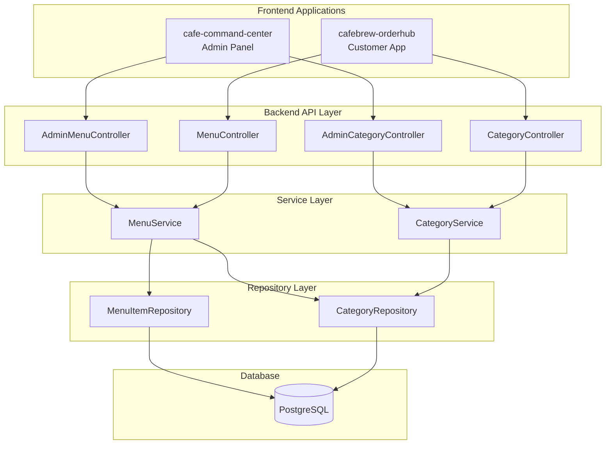

# Design Document: Menu and Category Management

## Overview

This design document outlines the implementation of dynamic menu item and category management for the CafeBrew application. The solution introduces a new `Category` entity with a proper relationship to `MenuItem`, provides RESTful APIs for CRUD operations, and updates both the admin panel (cafe-command-center) and customer app (cafebrew-orderhub) to consume these APIs.

The architecture follows the existing Spring Boot patterns in the backend and React/TypeScript patterns in the frontends, ensuring consistency with the current codebase.

## Architecture



## Components and Interfaces

### Backend Components

#### 1. Category Entity

```java
@Entity
@Table(name = "categories")
public class Category {
    @Id
    @GeneratedValue(strategy = GenerationType.IDENTITY)
    private Long id;
    
    @Column(nullable = false, unique = true, length = 50)
    private String name;
    
    @Column(length = 500)
    private String description;
    
    @Column(name = "display_order", nullable = false)
    private Integer displayOrder = 0;
    
    @Column(nullable = false)
    private Boolean active = true;
    
    @Column(name = "created_at", nullable = false)
    private LocalDateTime createdAt;
    
    @Column(name = "updated_at")
    private LocalDateTime updatedAt;
    
    @OneToMany(mappedBy = "category", fetch = FetchType.LAZY)
    private List<MenuItem> menuItems;
}
```

#### 2. Updated MenuItem Entity

```java
@Entity
@Table(name = "menu_items")
public class MenuItem {
    @Id
    @GeneratedValue(strategy = GenerationType.IDENTITY)
    private Long id;
    
    @Column(nullable = false, length = 100)
    private String name;
    
    @Column(length = 500)
    private String description;
    
    @ManyToOne(fetch = FetchType.LAZY)
    @JoinColumn(name = "category_id", nullable = false)
    private Category category;
    
    @Column(nullable = false, precision = 10, scale = 2)
    private BigDecimal price;
    
    @Column(nullable = false)
    private Boolean available = true;
    
    @Column(name = "image_url")
    private String imageUrl;
    
    @Column(name = "created_at", nullable = false)
    private LocalDateTime createdAt;
    
    @Column(name = "updated_at")
    private LocalDateTime updatedAt;
}
```

#### 3. CategoryService Interface

```java
public interface CategoryService {
    List<Category> getAllCategories();
    List<Category> getActiveCategories();
    Category getCategoryById(Long id);
    Category createCategory(CreateCategoryRequest request);
    Category updateCategory(Long id, UpdateCategoryRequest request);
    void deleteCategory(Long id);
    void reorderCategories(List<CategoryOrderRequest> orderRequests);
}
```

#### 4. MenuService Interface (Extended)

```java
public interface MenuService {
    // Existing methods
    List<MenuItem> getAvailableMenu();
    List<MenuItem> getAllMenuItems();
    void updateAvailability(Long menuItemId, boolean available);
    
    // New methods
    MenuItem getMenuItemById(Long id);
    MenuItem createMenuItem(CreateMenuItemRequest request);
    MenuItem updateMenuItem(Long id, UpdateMenuItemRequest request);
    void deleteMenuItem(Long id);
}
```

### API Endpoints

#### Category Endpoints

| Method | Endpoint | Auth | Description |
|--------|----------|------|-------------|
| GET | `/api/categories` | No | List active categories (public) |
| GET | `/api/admin/categories` | Yes | List all categories |
| POST | `/api/admin/categories` | Yes | Create category |
| PUT | `/api/admin/categories/{id}` | Yes | Update category |
| DELETE | `/api/admin/categories/{id}` | Yes | Delete category |
| PUT | `/api/admin/categories/reorder` | Yes | Reorder categories |

#### Menu Item Endpoints (Extended)

| Method | Endpoint | Auth | Description |
|--------|----------|------|-------------|
| GET | `/api/admin/menu/{id}` | Yes | Get single menu item |
| POST | `/api/admin/menu` | Yes | Create menu item |
| PUT | `/api/admin/menu/{id}` | Yes | Update menu item |
| DELETE | `/api/admin/menu/{id}` | Yes | Delete menu item |

### DTO Structures

#### Request DTOs

```java
// Category DTOs
public record CreateCategoryRequest(
    @NotBlank @Size(max = 50) String name,
    @Size(max = 500) String description,
    Integer displayOrder
) {}

public record UpdateCategoryRequest(
    @NotBlank @Size(max = 50) String name,
    @Size(max = 500) String description,
    Integer displayOrder,
    Boolean active
) {}

public record CategoryOrderRequest(
    @NotNull Long id,
    @NotNull Integer displayOrder
) {}

// Menu Item DTOs
public record CreateMenuItemRequest(
    @NotBlank @Size(max = 100) String name,
    @Size(max = 500) String description,
    @NotNull Long categoryId,
    @NotNull @Positive BigDecimal price,
    Boolean available,
    String imageUrl
) {}

public record UpdateMenuItemRequest(
    @NotBlank @Size(max = 100) String name,
    @Size(max = 500) String description,
    @NotNull Long categoryId,
    @NotNull @Positive BigDecimal price,
    Boolean available,
    String imageUrl
) {}
```

#### Response DTOs

```java
public record CategoryResponse(
    Long id,
    String name,
    String description,
    Integer displayOrder,
    Boolean active,
    Integer itemCount,
    LocalDateTime createdAt,
    LocalDateTime updatedAt
) {}

public record MenuItemResponse(
    Long id,
    String name,
    String description,
    Long categoryId,
    String categoryName,
    BigDecimal price,
    Boolean available,
    String imageUrl,
    LocalDateTime createdAt,
    LocalDateTime updatedAt
) {}
```

### Frontend Components

#### Admin Panel (cafe-command-center)

```
src/
├── api/
│   └── endpoints.ts          # Add category API methods
├── types/
│   └── index.ts              # Add Category types
├── hooks/
│   ├── useCategories.ts      # Category management hook
│   └── useMenu.ts            # Extended with CRUD operations
├── pages/
│   ├── MenuManagePage.tsx    # Extended with create/edit/delete
│   └── CategoriesPage.tsx    # New category management page
└── components/
    ├── menu/
    │   ├── MenuItemForm.tsx  # Create/Edit form modal
    │   └── DeleteConfirmDialog.tsx
    └── categories/
        ├── CategoryList.tsx
        ├── CategoryForm.tsx
        └── CategoryCard.tsx
```

#### Customer App (cafebrew-orderhub)

```
src/
├── api/
│   └── customerApi.ts        # Add getCategories method
├── types/
│   └── index.ts              # Update MenuCategory type
├── hooks/
│   └── useMenu.ts            # Fetch categories dynamically
└── components/
    └── menu/
        └── CategoryFilter.tsx # Dynamic category rendering
```

## Data Models

### Database Schema

```sql
-- New categories table
CREATE TABLE categories (
    id BIGSERIAL PRIMARY KEY,
    name VARCHAR(50) NOT NULL UNIQUE,
    description VARCHAR(500),
    display_order INTEGER NOT NULL DEFAULT 0,
    active BOOLEAN NOT NULL DEFAULT true,
    created_at TIMESTAMP NOT NULL DEFAULT CURRENT_TIMESTAMP,
    updated_at TIMESTAMP
);

-- Updated menu_items table
ALTER TABLE menu_items 
    ADD COLUMN category_id BIGINT,
    ADD CONSTRAINT fk_menu_items_category 
        FOREIGN KEY (category_id) REFERENCES categories(id);

-- Migration: Convert existing string categories to category_id
-- (handled by DataInitializer or migration script)
```

### TypeScript Types

```typescript
// Admin Panel Types
interface Category {
  id: number
  name: string
  description: string | null
  displayOrder: number
  active: boolean
  itemCount?: number
  createdAt: string
  updatedAt: string
}

interface CreateCategoryRequest {
  name: string
  description?: string
  displayOrder?: number
}

interface UpdateCategoryRequest {
  name: string
  description?: string
  displayOrder?: number
  active?: boolean
}

interface CreateMenuItemRequest {
  name: string
  description?: string
  categoryId: number
  price: number
  available?: boolean
  imageUrl?: string
}

interface UpdateMenuItemRequest {
  name: string
  description?: string
  categoryId: number
  price: number
  available?: boolean
  imageUrl?: string
}

// Updated MenuItem type
interface MenuItem {
  id: number
  name: string
  description: string
  categoryId: number
  categoryName: string
  price: number
  available: boolean
  imageUrl?: string
  createdAt: string
  updatedAt: string
}
```

## Correctness Properties

*A property is a characteristic or behavior that should hold true across all valid executions of a system-essentially, a formal statement about what the system should do. Properties serve as the bridge between human-readable specifications and machine-verifiable correctness guarantees.*

### Property 1: Category CRUD Round-Trip

*For any* valid category data (name, description, displayOrder), creating a category and then fetching it by ID should return an equivalent category object with all fields preserved.

**Validates: Requirements 1.1, 1.3**

### Property 2: Category Name Uniqueness

*For any* two categories with the same name, the system should reject the second creation attempt and return a validation error.

**Validates: Requirements 1.2, 9.5**

### Property 3: Category Display Order Sorting

*For any* set of categories with different displayOrder values, fetching all categories should return them sorted in ascending order by displayOrder.

**Validates: Requirements 1.5, 1.6**

### Property 4: Category Deactivation Hides Menu Items

*For any* category with associated menu items, when the category is deactivated, the public menu endpoint should not return any items from that category.

**Validates: Requirements 1.4, 8.4**

### Property 5: Category Deletion Prevention

*For any* category that has one or more associated menu items, attempting to delete that category should fail with an appropriate error, and the category should remain in the database.

**Validates: Requirements 2.6**

### Property 6: Menu Item CRUD Round-Trip

*For any* valid menu item data (name, description, categoryId, price, available, imageUrl), creating a menu item and then fetching it by ID should return an equivalent menu item object with all fields preserved.

**Validates: Requirements 3.1, 3.2, 3.3, 4.5**

### Property 7: Menu Item Validation

*For any* menu item creation request, the system should reject requests with: empty name, non-positive price, or non-existent/inactive categoryId, returning appropriate validation errors.

**Validates: Requirements 3.4, 3.5, 9.1**

### Property 8: Field Length Validation

*For any* string input exceeding the maximum length (100 chars for menu item name, 50 chars for category name, 500 chars for descriptions), the system should reject the request with a validation error.

**Validates: Requirements 9.4, 9.5, 9.6**

### Property 9: Error Response Format

*For any* invalid request (validation failure, not found, unauthorized), the system should return the appropriate HTTP status code (400, 404, 401) with a response body containing timestamp, status, error, and message fields.

**Validates: Requirements 9.1, 9.2, 9.3**

### Property 10: Timestamp Auto-Management

*For any* created entity (category or menu item), createdAt should be automatically set to the current time. *For any* updated entity, updatedAt should be automatically updated to the current time while createdAt remains unchanged.

**Validates: Requirements 3.6**

### Property 11: Menu Item Response Includes Category Name

*For any* menu item fetch operation, the response should include both the categoryId and the categoryName for display purposes.

**Validates: Requirements 8.2**

## Error Handling

### Backend Error Handling

The backend uses a global exception handler to provide consistent error responses:

```java
@RestControllerAdvice
public class GlobalExceptionHandler {
    
    @ExceptionHandler(MethodArgumentNotValidException.class)
    public ResponseEntity<ErrorResponse> handleValidationErrors(MethodArgumentNotValidException ex) {
        String message = ex.getBindingResult().getFieldErrors().stream()
            .map(error -> error.getField() + ": " + error.getDefaultMessage())
            .collect(Collectors.joining(", "));
        return ResponseEntity.badRequest()
            .body(new ErrorResponse(LocalDateTime.now(), 400, "Bad Request", message));
    }
    
    @ExceptionHandler(EntityNotFoundException.class)
    public ResponseEntity<ErrorResponse> handleNotFound(EntityNotFoundException ex) {
        return ResponseEntity.status(404)
            .body(new ErrorResponse(LocalDateTime.now(), 404, "Not Found", ex.getMessage()));
    }
    
    @ExceptionHandler(CategoryHasItemsException.class)
    public ResponseEntity<ErrorResponse> handleCategoryHasItems(CategoryHasItemsException ex) {
        return ResponseEntity.badRequest()
            .body(new ErrorResponse(LocalDateTime.now(), 400, "Bad Request", ex.getMessage()));
    }
    
    @ExceptionHandler(DuplicateCategoryNameException.class)
    public ResponseEntity<ErrorResponse> handleDuplicateName(DuplicateCategoryNameException ex) {
        return ResponseEntity.badRequest()
            .body(new ErrorResponse(LocalDateTime.now(), 400, "Bad Request", ex.getMessage()));
    }
}
```

### Custom Exceptions

```java
public class CategoryHasItemsException extends RuntimeException {
    public CategoryHasItemsException(String categoryName, int itemCount) {
        super("Cannot delete category '" + categoryName + "' because it has " + itemCount + " menu items");
    }
}

public class DuplicateCategoryNameException extends RuntimeException {
    public DuplicateCategoryNameException(String name) {
        super("Category with name '" + name + "' already exists");
    }
}

public class CategoryNotFoundException extends EntityNotFoundException {
    public CategoryNotFoundException(Long id) {
        super("Category not found with id: " + id);
    }
}

public class MenuItemNotFoundException extends EntityNotFoundException {
    public MenuItemNotFoundException(Long id) {
        super("Menu item not found with id: " + id);
    }
}
```

### Frontend Error Handling

Both frontend applications handle errors consistently:

```typescript
// Error handling in API client
const handleApiError = (error: unknown): never => {
  if (error instanceof Response) {
    throw new ApiError(error.status, await error.json())
  }
  throw error
}

// Toast notifications for user feedback
const showError = (message: string) => {
  toast.error(message)
}

const showSuccess = (message: string) => {
  toast.success(message)
}
```

## Testing Strategy

### Unit Tests

Unit tests focus on specific examples and edge cases:

1. **Service Layer Tests**
   - Test CategoryService methods with mock repository
   - Test MenuService methods with mock repository
   - Test validation logic for edge cases

2. **Controller Tests**
   - Test endpoint routing and HTTP status codes
   - Test request/response serialization
   - Test authentication requirements

3. **Frontend Component Tests**
   - Test form validation behavior
   - Test component rendering with mock data
   - Test user interaction flows

### Property-Based Tests

Property-based tests validate universal properties across many generated inputs using a PBT library (JUnit QuickCheck for Java, fast-check for TypeScript).

**Configuration:**
- Minimum 100 iterations per property test
- Each test references its design document property
- Tag format: **Feature: menu-category-management, Property {number}: {property_text}**

**Backend Property Tests (Java with JUnit QuickCheck):**

```java
@RunWith(JUnitQuickcheck.class)
public class CategoryServicePropertyTest {
    
    // Property 1: Category CRUD Round-Trip
    @Property(trials = 100)
    public void categoryRoundTrip(@From(CategoryGenerator.class) CreateCategoryRequest request) {
        Category created = categoryService.createCategory(request);
        Category fetched = categoryService.getCategoryById(created.getId());
        
        assertEquals(request.name(), fetched.getName());
        assertEquals(request.description(), fetched.getDescription());
    }
    
    // Property 2: Category Name Uniqueness
    @Property(trials = 100)
    public void categoryNameUniqueness(@From(CategoryNameGenerator.class) String name) {
        categoryService.createCategory(new CreateCategoryRequest(name, null, 0));
        
        assertThrows(DuplicateCategoryNameException.class, () -> 
            categoryService.createCategory(new CreateCategoryRequest(name, null, 1))
        );
    }
}
```

**Frontend Property Tests (TypeScript with fast-check):**

```typescript
import fc from 'fast-check'

// Property 8: Field Length Validation
test('rejects names exceeding max length', () => {
  fc.assert(
    fc.property(
      fc.string({ minLength: 101, maxLength: 200 }),
      (longName) => {
        const result = validateMenuItemName(longName)
        expect(result.valid).toBe(false)
      }
    ),
    { numRuns: 100 }
  )
})
```

### Integration Tests

Integration tests verify end-to-end flows:

1. **API Integration Tests**
   - Test full request/response cycle with real database
   - Test authentication flow
   - Test cascade behaviors (category deactivation)

2. **Frontend Integration Tests**
   - Test API client integration
   - Test form submission flows
   - Test error handling with real API responses

### Test Coverage Goals

- Backend: 80% line coverage, 100% coverage of service methods
- Frontend: 70% line coverage, 100% coverage of API functions
- All 11 correctness properties implemented as property-based tests

